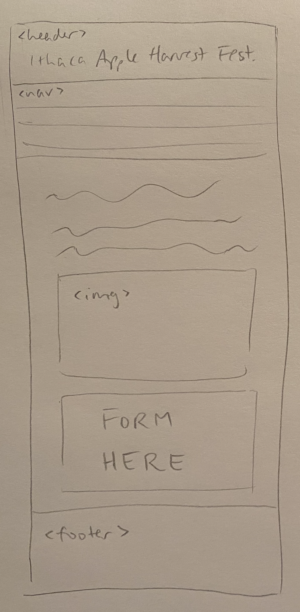
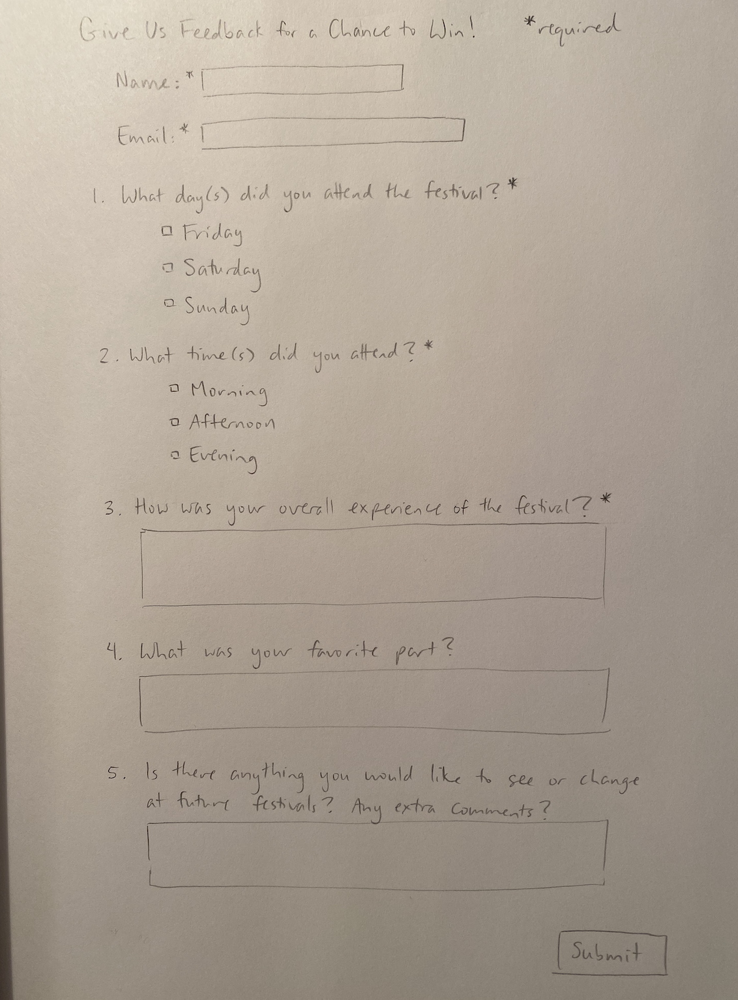
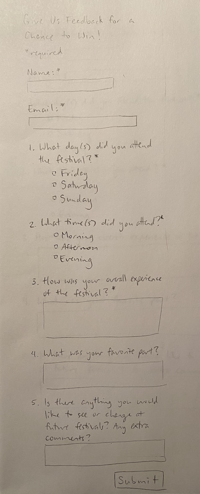
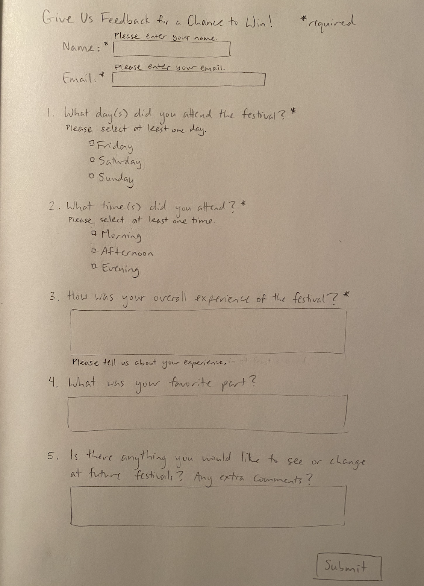
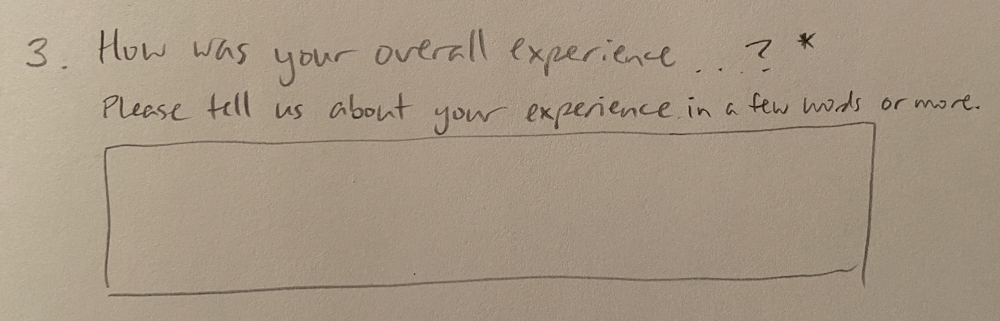
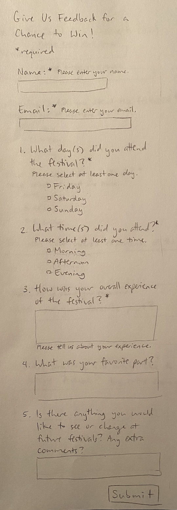
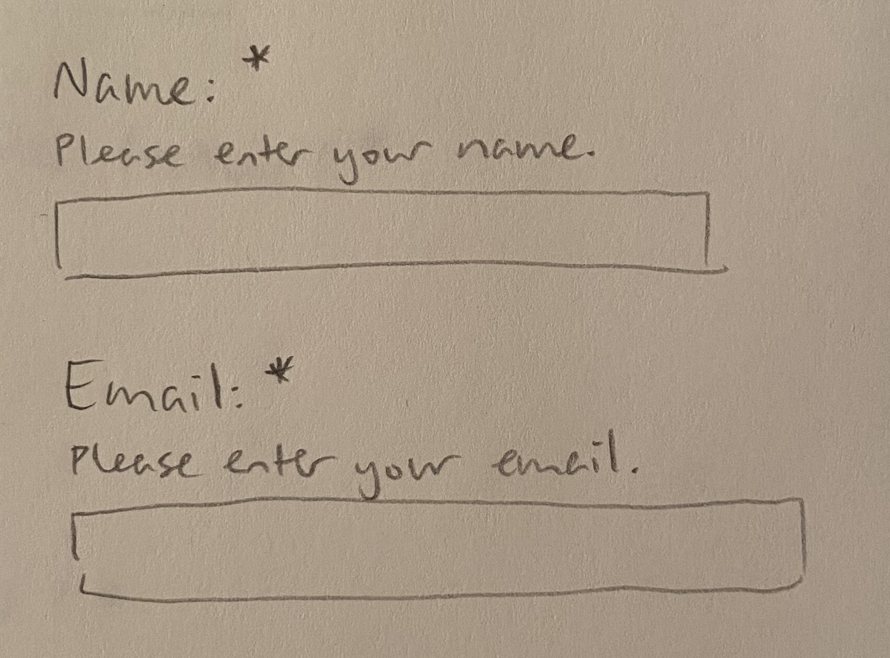

# Project 3: Design Journey

**For milestones, complete only the sections that are labeled with that milestone.**

Be clear and concise in your writing. Bullets points are encouraged.

**Everything, including images, must be visible in Markdown Preview.** If it's not visible in Markdown Preview, then we won't grade it. We won't give you partial credit either.

**Make the case for your decisions using concepts from class, as well as other design principles, theories, examples, and cases from outside of class.**

You can use bullet points and lists, or full paragraphs, or a combination, whichever is appropriate. The writing should be solid draft quality but doesn't have to be fancy.

## Project 1 or Project 2
> Which project will you add a form to?

Project 2


## Audience (Milestone 1)
> Who is your site's target audience? This should be the original audience from Project 1 or Project 2. You may adjust the audience if necessary. Just make sure you explain your rationale for doing so here.

The target audience for the website is parents and other family members of college students who are visiting Ithaca and are interested in exploring what the city has to offer.


## Audience's Needs (Milestone 1)
> List the audience's needs that you identified in Project 1 or 2. Just list each need. No need to include the "Design Ideas and Choices", etc. You may adjust the needs if necessary. However, any changes you make to the needs for this project should be clearly identified and justified.

- Need 1: Location, Directions, & Parking Information
  - Information on the location of the festival, how to get there, and where to park (if arriving by car)
- Need 2: About the Festival: When/Where, Things to See/Do
  - Information on what/when/where the festival is and what is at the festival (e.g. specific things to see and do at the festival)
- Need 3: History of the Festival
  - When it began, how it began, what its purpose is, etc.


## HTML Form + User Needs Brainstorming (Milestone 1)
> Using the audience needs you identified, brainstorm possible options for an HTML form for the site. List each idea and provide a brief rationale for how the HTML form addresses that need.

- A feedback form that asks about people's experience at the festival
  - This would allow visitors to provide feedback on things they enjoyed and things that they think need improvement at the festival. For example, if they had difficulty finding parking, they could submit that feedback to improve it next year.
- A form to enter a raffle to win a prize at the festival
  - This raffle would give people visiting Ithaca incentive to attend the festival.
- A trivia quiz about the festival with a chance to win a prize if you get all the questions correct
  - This would give people incentive to explore the site to learn more about the festival and attend it.


## HTML Form Proposal & Rationale (Milestone 1)
> Make a decision about your site's form. Describe the purpose of your proposed form for your Project 1 or 2 site. Provide a brief rationale explaining how your proposed form meets the needs of your site's audience.
> Note: If your form is a contact form, we expect to see a thorough justification explaining how a contact form addresses the user's _actual_ needs. In your justification explain how a contact form better suits the needs of your user compared to the alternatives (e.g. sending you an email using your email address).

Form Proposal:
The purpose of the form is to collect feedback on users' experiences at the festival. It gives users incentive to fill out the form by entering them in a raffle to win a prize if they submit the form.

User Needs Rationale:
This form allows users to give feedback on whether their needs were met, and will help improve their future experiences with the festival.


## Form User Data (Milestone 1)
> Think through and plan the data you need to collect from the users. Do you need their name? Email address? etc.

- Name
- Email address
- What day(s) they attended the festival
- What time of day they attended the festival
- How their overall experience was
- Favorite part of the festival
- Anything they would change or anything they would like to see at future festivals


## Form Components & Validation Criteria (Milestone 1)
> For each piece of data you plan to collect from the users, identify an appropriate HTML component to collect that data and decide the validation criteria (e.g. whether this data is _required_). Briefly explain your reasoning for the component choice and the validation criteria.

- Name (optional): text field; `<input type="text">`
  - Required b/c a name is needed to address them in the email if they win the raffle
  - Text field b/c only one line of text is needed
- Email (required): email field; `<input type="email">`
  - Required as a way to contact them if they win the raffle
  - Email field to restrict the input to an email address
- Day(s) attended (required): checkboxes; `<input type="checkbox">`
  - Required b/c festival organizers can use this data to see what days are the most popular
  - Checkboxes b/c people might have attended multiple days
- Time(s) attended (required): checkboxes; `<input type="checkbox">`
  - Required b/c festival organizers can use this data to see what times of day are the busiest
  - Checkboxes b/c people might have attended multiple times of day
- Overall experience (required): multi-line text field; `<input type="textarea">`
  - Required b/c festival organizers can use this feedback to get a general feel for how people liked the festival
  - Text area b/c users may type multiple sentences
- Favorite part (optional): multi-line text field; `<input type="textarea">`
  - Optional so that users can go into more specific detail if they want to, but it is not necessary
  - Text area b/c users may type multiple sentences
- Anything new or to change for future festivals (optional): multi-line text field; `<input type="textarea">`
  - Optional b/c users may not have any suggestions/things they want to change
  - Text area b/c users may type multiple sentences


## Form Location (Milestone 1)
> Which HTML file will you place your form?

index.html

> Sketch the location of the form in that page. This sketch need not be fancy. You don't need to provide many details of the page or form. Just plan the location of the form on the page and communicate that to us. You can literally have a box that says "FORM HERE."

**Desktop Location**


**Mobile Location**




## Form Design (Milestone 1)
> Include sketches on your form below. Include sketches of your **mobile and desktop** versions without corrective feedback. Show us the evolution of your design and the alternatives you considered.

**Desktop Sketches**



**Mobile Sketches**




- After coding the form, I noticed that having the name and email fields aligned completely to the left of the page looked odd. I decided to change their alignment so that they were in line with the questions below, like in the desktop version.


## Form Feedback Design (Milestone 1)
> Include sketches of your **mobile and desktop** with _corrective feedback_. Show us the evolution of your design and the alternatives you considered.

**Desktop Feedback**




- I decided to move the feedback for the third question. Instead of below the text input area, I moved it above the text input area and below the question. The feedback messages for the rest of the components are below the questions, so this placement is more consistent.
  - I changed the feedback message from "Please tell us about your experience" to be more specific and clear about the minimum required answer for this question: "Please tell us about your experience in a few words or more."
- I also decided to change the email feedback message from "Please enter your email" to "Please enter a valid email". I believe this is more clear and corrective. For instance, users may have entered their email but made a typo, which my original feedback did not address.


**Mobile Feedback**


- As explained in the desktop section, I decided to move the feedback message for the third question to above the text input area and below the question. (see desktop version for sketch/explanation)


- I decided to place the feedback for the name and email fields below the prompt and above the text field, like in the desktop version. Although it does look bulkier, this would make it consistent with the feedback placement for the rest of the form. Consistency is important, so I made this design change.
- I also changed the alignment of the name and email fields to line up with the questions below (see sketch/explanation in form design section)


## Form Implementation Planning (Milestone 1)
> What submission method will your form use? GET or POST. Explain your reasoning.

My form will use POST because it collects personal information like the user's name and email address, so it should use a secure submission method.

> For your site's `<form>` element, plan all HTML attributes that you will need and their values. Hint: action=, method=, novalidate

- `method="post"`
- `action="https://www.cs.cornell.edu/courses/cs1300/2020fa/submit.php"`
- `novalidate`


## Additional Information (Milestone 1)
> (optional) Include any additional information, justifications, or comments we should be aware of.

Above the form, I also plan to add a sentence or two describing what the form is for and how the raffle will work (deadline to enter, prizes, etc.) to give users some extra context.


## Plan Validation Pseudocode (Final Submission)
> Write your form validation pseudocode here.

```
When the user submits the form:
  If name component data is valid:
    Hide name's feedback message.
  Otherwise,
    Show a feedback message "Please enter your name."
    Do not submit the form.

  If email component data is valid:
    Hide email's feedback message.
  Otherwise,
    Show a feedback message "Please enter your email."
    Do not submit the form.

  If day component data is valid:
    Hide day's feedback message.
  Otherwise,
    Show a feedback message "Please select at least one day."
    Do not submit the form.

  If time component data is valid:
    Hide time's feedback message.
  Otherwise,
    Show a feedback message "Please select at least one time."
    Do not submit the form.

  If experience component data is valid:
    Hide experience's feedback message.
  Otherwise,
    Show a feedback message "Please tell us about your experience."
    Do not submit the form.

  If all form data are valid:
    Send form data to the server.
  Else:
    Do not send form data to the server.
```


## Additional Design Justifications (Final Submission)
> If you feel like you haven’t fully explained your design choices in the final submission, or you want to explain some functions in your site (e.g., if you feel like you make a special design choice which might not meet the final requirement), you can use the additional design justifications to justify your design choices. Remember, this is place for you to justify your design choices which you haven’t covered in the design journey. Use it wisely. However, you don’t need to fill out this section if you think all design choices have been well explained in the final submission design journey.

N/A


## Self-Reflection (Final Submission)
> This was the first project in this class where you coded some JavaScript. What did you learn from this experience?

I learned that coding JavaScript is not as intimidating as I was initially afraid of. Although we did not delve deeply into the actual coding aspect,  using pseudocode to plan out code and and breaking down all the different aspects of the language helped improve my understanding a lot. I learned that there is still so much to learn, but it is far from impossible, even though it may be hard at times.


> Reflect on how HTML, CSS, and JavaScript together support client-side interactivity. If it's helpful, you can describe your mental model of client-side interactivity or explain how the general idea of showing and hiding content can be used to implement other forms of client-side interactivity beyond form validation and feedback.

Our HTML code forms the base of client-side interactivity. We add content to be "hidden" in HTML. Then, we use a CSS class to hide the "hidden" content. Finally, we program JavaScript to show or hide this content when a certain event occurs. It is in this way that HTML, CSS, and JavaScript support client-side interactivity when put together. There are many different forms of client-side interactivity that use this system of showing and hiding content. For example, on an FAQ page, clicking on a question might display the answer, and clicking on it again hides it. The answer is coded in HTML, hidden by default with CSS, and finally programmed to show on a click event.


> Take some time here to reflect on how much you've learned since you started this class. It's often easy to ignore our own progress. Take a moment and think about your accomplishments in this class. Hopefully you'll recognize that you've accomplished a lot and that you should be very proud of those accomplishments!

I have learned so much since I've started this class! Just about everything that we learned in this class was new information to me. Before, web sites and how they worked and were implemented were a complete mystery. I had never really thought about responsive design and accessibility, and took it for granted in my everyday life. I had no idea how the simplest static web page worked, much less an interactive one with a submittable form. Now, looking back at our previous two projects as well as this one, I can see how far I've come and how much knowledge I've gained thanks to this class.
